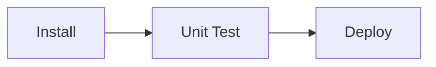

  <h3 align="center">Users Microservice</h3>
  

    Microservice for CRUD management of users.
  

## About

A user management microservice based on AWS CDK using API Gatway and Lambda.

## Built With

### Languages

- TypeScript

### Frameworks

- AWS CDK
- Jest

### AWS

- API Gateway
- Lambda

## CI Pipeline

Powered by GitHub Actions.

## Getting Started

- `npm run build` compile typescript to js
- `npm run watch` watch for changes and compile
- `npm run test` perform the jest unit tests
- `cdk deploy` deploy this stack to your default AWS account/region
- `cdk diff` compare deployed stack with current state
- `cdk synth` emits the synthesized CloudFormation template
